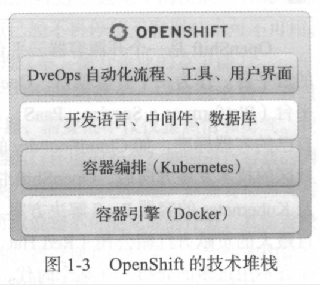
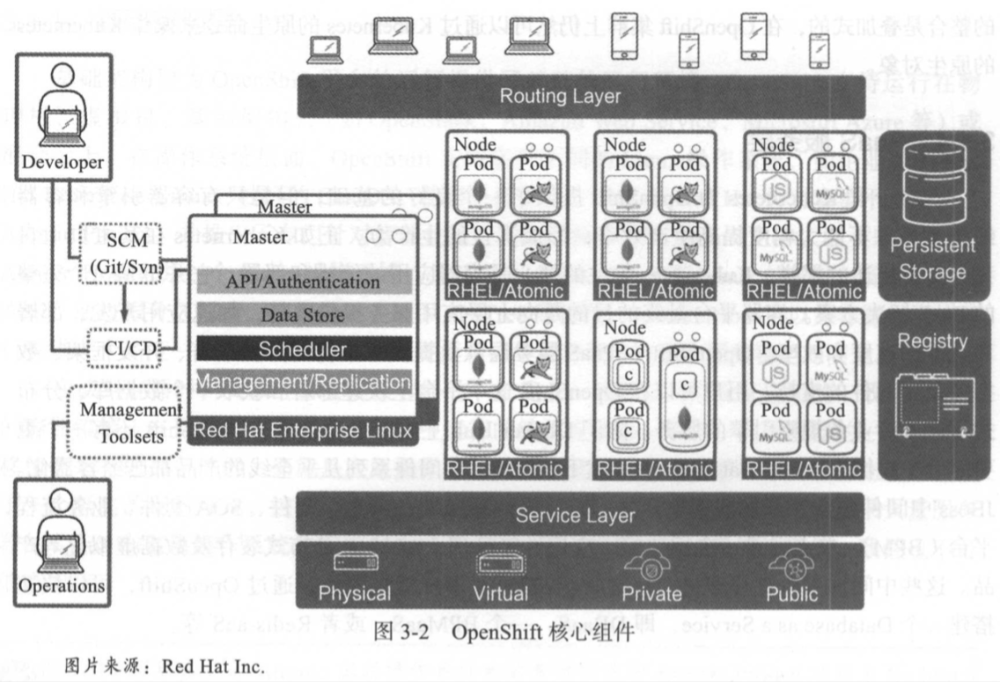
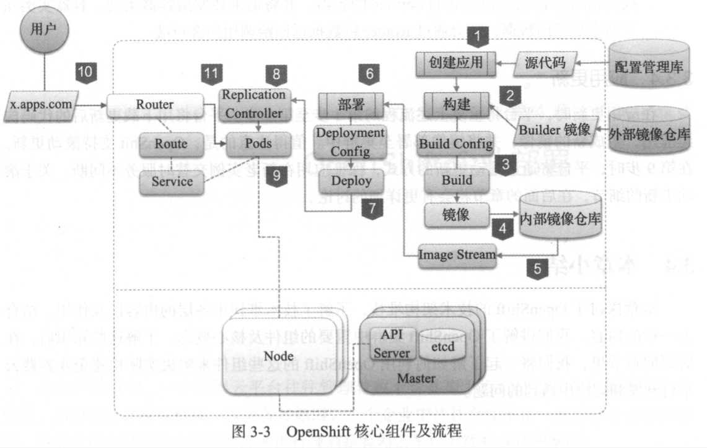

Title: openshift 3
Date: 2019-05-23 12:00
Modified: 2019-05-23 12:00
Category: micros
Tags: openshift 3, micro service
Slug: openshift-3
Author: Mingz
Summary: openshift 3
Status: published

# OpenShift 3

## 概念

### Red Hat
- Red Hat就是开源软件商业模式的奠基人，而且是目前世界上最大的开源软件公司。
- 作为一个开源软件公司，red hat所有产品的企业版的源代码也是完全公开的。
- Red Hat是Kubernetes, Istio的主要贡献者之一。

### OpenShift

- OpenShift是一个开源容器云平台，是一个基于主流的容器技术Docker及Kubernetes构建的云平台。
- 通过OpenShift这个平台，企业可以快速在内部网络中构建出一个多租户的云平台，在这朵云上提供应用开发，测试，部署，运维的各项服务（如图1-2所示）。
- OpenShift在一个平台上贯通开发，测试，部署，运维的流程，实现高度的自动化，满足应用持续集成及持续交付和部署的需求；满足企业及组织对容器管理，容器编排的需求。
- 通过OpenShift的灵活架构，企业可以以OpenShift作为核心，在其上搭建一个企业的DevOps引擎，推动企业的DevOps变革和转型。

容器引擎及容器编排组件是两项关键的技术，但还不能满足生产效率的要求。
OpenShift在Docker和k8s的基础上提供了各种功能，以满足业务应用，研发用户及运维用户在生产效率上的诉求。
- 应用开发框架及中间件
- 应用及服务目录
- 自动化流程及工具。
- 软件自定义网络
- 性能监控及日志管理
- 多用户接口
- 自动化集群部署及管理

### 混合云
### DevOps
### CI/CD

## 演示
- 演示本地macos的OpenShift单节点集群
- 演示OpenShift的Web Dashboard

## todos demo

## 参考资料

### GitHub
https://github.com/openshift

### WebSite
- http://www.openshift.org
- https://www.okd.io/

### Books
- 《开源容器云OpenShift 构建基于Kubernetes的企业应用云》
